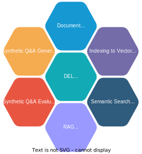
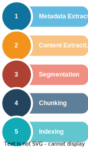
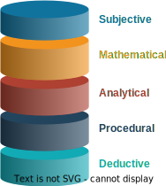
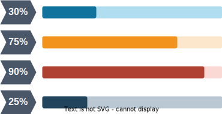

# Document Extraction Libraries 4.0.0

## Introduction:

Document Extraction Libraries are a suite of Python/Java libraries that provide APIs to **extract information from documents** (e.g., scanned/native PDFs, images, etc.). For semi-structured documents (e.g., form-like documents), this can be done in a simple and predictable manner. For unstructured documents, it can extract the raw content, retrieve relevant text from it using **semantic search**, and use a **Large Language Model (LLM)** to extract information.

The suite consists of libraries that can:
- **Generate** OCR files using free/commercial tools.
- **Parse** OCR files to extract regions of interest.
- **Extract** texts, selection field values, and table data from regions of interest.
- **Generate embeddings** and save them to a vector DB for retrieval and contextual use with LLMs.

Additionally, it includes a data pipeline framework - **Document Processor Platform (DPP)** - for creating **reusable components** and **configurable pipelines**. The pipeline brings all the libraries together to create a logical workflow.

These libraries can be used as SDKs to solve document digitization problems and help with semantic search and information extraction requirements.

## DEL Ecosystem:

The DEL ecosystem provides a comprehensive set of functionalities for document ingestion, indexing, semantic search, and evaluation. It is designed to streamline document processing workflows and enable efficient information retrieval.  DEL integrates multiple stages of document processing into a seamless pipeline, leveraging advanced AI techniques such as Optical Character Recognition (OCR), embeddings, and Large Language Models (LLMs).  It is scalable for large-scale document processing using distributed systems like Kubernetes and Ray Serve, and its modular libraries and processors allow for customization to meet specific business needs.  Below are the various features that DEL offers:
 
 
 

### Document Ingestion:

- **Metadata Extraction**: Extracts specific metadata from documents based of some questions asked with the help of LLM's. This metadata helps in categorizing and searching across indexes, making it easier to manage large document repositories.
- **Content Extraction**: Retrieve raw text and content from scanned or native documents. This includes extracting text from PDFs, images, or other formats, enabling downstream processing like indexing or analysis.
- **Segmentation**: Divide documents into logical sections or segments for easier processing. For example, splitting a multi-page document into smaller sections to focus on specific parts during analysis.
- **Chunking**: Break down large documents into smaller chunks. This is particularly useful for processing lengthy documents for tasks like embedding generation, where smaller chunks improve accuracy.
- **Indexing**: Organize and store document content for efficient retrieval. This involves creating structured indexes that allow for quick and accurate searches.

### Indexing to VectorDB:
- **Vector Indexing**: Use vector embeddings (e.g., `OpenAI`, `Sentence Transformer`, etc) to index documents for semantic search.
- **Sparse Indexing**: Leverage algorithms like `BM25` for keyword-based search.

### Semantic Search and Q&A:
- **Vector DB Search**: Retrieve relevant content using semantic embeddings stored in a vector database.
- **Sparse DB Search**: Perform keyword-based searches using algorithms like `BM25`.
- **Hybrid Search**: Combine vector and sparse search results using the `Reciprocal Rank Fusion (RRF)` algorithm for improved accuracy.
- **Metadata Filtering**: Filter search results based on metadata extracted during document ingestion.

### Synthetic Q&A Generation:

- **Question-Answer Pair Generation**: Ability to generate synthetic question-and-answer pairs from document content.
- **Supported Context Types**: `Chunk` and `Segment`.
- **Custom Metadata**: It can use custom metadata if available for more specificity in generating the questions.
- **Question Types**: Questions can be generated based on but not limited to various types such as `Subjective`, `Mathematical`, `Analytical`, `Procedural`, `Deductive`, etc.

### Synthetic Q&A Evaluation:

- **LLM-Based Evaluation**: Use a `Large Language Model (LLM)` to evaluate the quality of synthetically generated question-and-answer pairs. This ensures the generated data is contextually accurate and reliable.

### RAG Evaluation:

- **RAGAS Metrics**: Evaluate datasets containing questions, answers, ground truth, and contexts using `RAGAS (RAG Assessment)` metrics.

## Flow Diagram:

The diagram below illustrates the architectural flow of the Document Extraction Libraries (DEL). It highlights how DEL integrates various components to process documents, extract information, and enable semantic search and evaluation.:

## Libraries:

The details of each library and its core functionality are given below:

| **S#** | **Library**               | **Description**                                                                 |
|--------|---------------------------|---------------------------------------------------------------------------------|
| 1      | **infy_ocr_generator**    | Provides APIs to generate OCR files by specifying an OCR provider.              |
| 2      | **infy_ocr_parser**       | Provides APIs to parse OCR files and detect regions of interest (bounding boxes) when given a search criteria. |
| 3      | **infy_field_extractor**  | Provides APIs for extracting free text and selection fields (checkboxes and radio buttons) from image files using regions of interest (bounding boxes) as input. |
| 4      | **infy_table_extractor**  | Provides APIs to extract rows and columns from an image of a table.             |
| 5      | **infy_object_detector**  | Provides APIs for table detection in documents as well as table structure recognition. |
| 6      | **infy_common_utils**     | Provides APIs to invoke external tools like JAR files.                          |
| 7      | **infy_fs_utils**         | Provides APIs to abstract underlying file system and object stores.             |
| 8      | **infy_gen_ai_sdk**       | Provides APIs for using embeddings, Large Language Models (LLM), vector DB, etc.|
| 9      | **infy_dpp_sdk**          | The SDK for Document Processor Platform (DPP) containing the interfaces for processors, schema definition for document data, and in-built orchestrators to execute a data pipeline made from processors. |
| 10     | **infy_dpp_core**         | A collection of processors for core tasks like request creation, metadata extraction, etc. |
| 11     | **infy_dpp_segmentation** | A collection of processors for tasks like document segmentation, chunk creation, etc. |
| 12     | **infy_dpp_ai**           | A collection of processors for tasks like generating embeddings, calling LLMs with prompt templates, etc. |
| 13     | **infy_dpp_storage**      | A collection of processors to help store data to graph databases, etc.          |
| 14     | **infy_dpp_content_extractor** | A collection of processors for extracting raw contents from documents.     |
| 15     | **infy_dpp_attribute_extractor** | Provides processors to extract attributes from documents using region-based definitions (RD). |
| 16     | **infy_content_generator** | Provides APIs to generate question-answer pairs from documents.                |
| 17     | **infy_dpp_content_generator** | A collection of processors designed to generate content, such as question-answer pairs, from documents. |
| 18     | **infy_model_evaluation** | Provides APIs to evaluate content such as Q&A pairs and assess the performance of LLMs in Retrieval-Augmented Generation (RAG) workflows. |
| 19     | **infy_dpp_evaluator**    | A collection of processors designed to evaluate Q&A pairs, assess RAG workflows, and generate detailed evaluation reports. |
| 20     | **InfyFormatConverterJAR**| Provides APIs to convert documents from one format to another (e.g., PDF to image, JSON, etc.). |
| 21     | **InfyOcrEngineJAR**      | Provides APIs to invoke OCR engines. Currently, it supports Tesseract.          |

## Apps:

The details of each app and its core functionality are given below:

| S# | App                         | Description                                                                 |
|----|-----------------------------|-----------------------------------------------------------------------------|
| 1  | **infy_dpp_processor**      | Implementation of the indexing pipeline. These apps can be deployed as Docker images on a Kubernetes cluster and managed via an orchestrator like Airflow or Kubeflow to run the indexing pipeline. |
| 2  | **infy_dpp_eval_processor** | Implementation for synthetic data generation, evaluation, and RAG evaluation. These apps can be deployed as Docker images on a Kubernetes cluster and managed via an orchestrator like Airflow or Kubeflow to run the evaluation pipelines. |

## Services:

The details of each service and its core functionality are given below:

| S# | Service                   | Description                                                                 |
|----|---------------------------|-----------------------------------------------------------------------------|
| 1  | **infy_model_service**    | A REST API service that runs a Ray Serve to host necessary models locally, enabling fast and efficient execution of the DEL pipelines. |
| 2  | **infy_db_service**       | Provides two options for storing created indexes: locally in the environment where the indexing pipeline is running, or centrally using `infy_db_service`. This service allows indexes to be stored in a central environment. |
| 3  | **infy_resource_service** | A REST API service for storing documents used during indexing in a separate location. It also provides APIs to retrieve these documents. |
| 4  | **infy_search_service**   | Implementation of the inferencing pipeline. If `infy_db_service` is used to store created indexes, `infy_search_service` can be used to query those documents. |

## How does it Work:

This section explains how DEL processes both semi-structured and unstructured documents to extract meaningful information:

### Semi-structured documents:

The libraries use **computer vision** in the form of an **OCR engine** (e.g. Tesseract, Azure OCR Read etc.) for positional text detection. It then takes a "region definition" as input and applies techniques to detect regions of interest within the document. 

This makes it possible to extract attributes -**free text, selection fields (checkboxes, radio buttons) and bordered tables** - specifically from the regions of interest and eliminates the risk of potential errors in future should the document layout change but not the regions of interest. 

### Unstructured documents:

The libraries along with the data pipeline framework help create a workflow where raw content is extracted from documents and stored in a vector DB as embeddings. From this, useful information is extracted using the Retrieval augmented generation (RAG) approach. 

The API logical input/output is given below. 

Step |Library | Input | Output  
---|---|---|---|
1 | infy_ocr_generator | `image file` | `OCR file` 
2 | infy_ocr_parser | `OCR file`, `region definition` | `region of interest [x,y,w,h]`
3 | infy_field_extractor | `OCR file`, `region of interest [x,y,w,h]` | `text`, `checkbox state(T/F)`, `radio button state(T/F)` 
4 | infy_table_extractor | `image file` | `table data with rows and cols` 
5  | infy_dpp_core   infy_dpp_segmentation   infy_dpp_ai   infy_dpp_storage   infy_dpp_content_extractor  | `config_data,document_data, context_data` | `document_data, context_data`

## Component Diagram:

The following diagram illustrates the architecture of the Document Extraction Libraries and how its components interact:

## Software Requirements:
To use the **Document Extraction Libraries (DEL)**, ensure your environment meets the following prerequisites:
- **Python**: Version >= 3.10.5 and < 3.12  
- **Java**: JDK or JRE >= 8  
- **Apache Maven**: Version >= 3.8  

## Getting Started: 

To begin using the **Document Extraction Libraries (DEL)**, follow the steps below to set up and explore its features:

1. **Setup and Installation :**
   - Follow the detailed instructions for:
      * Installing prerequisites and dependencies.
      * Setting up the environment.
      * Running your first pipeline.

   Refer to the **[Setup Guide](docs/SetupGuide.md)** for step-by-step guidance.

2. **Choose Your Workflow**:
   - **App Flow :** Use pre-built apps, services, and tools to run pipelines for document indexing, searching, and evaluation. This workflow is ideal for production-ready use cases.
   - **Notebook Flow :** Use Jupyter Notebooks to interactively explore and experiment with DEL’s capabilities. This workflow is perfect for prototyping and learning.

3. **Run Your First Pipeline :**
   - For **App Flow**, follow the instructions in the **[App Flow Guide](docs/AppFlow.md)** to execute DEL indexing and evaluation pipelines.
   - For **Notebook Flow**, follow the instructions in the **[Notebook Flow Guide](docs/notebook/NotebookFlow.md)** to execute DEL pipelines via jupyter notebooks.

4. **Learn and Customize :**
   - DEL includes the **Document Processor Platform (DPP)** for creating reusable components and configurable pipelines.
   - Explore the **[Libraries Overview](#libraries)** to gain a deeper understanding of the core functionalities of each library and its processors.
   - Customize pipelines by combining libraries and processors to address your specific use cases effectively.
