## 1. Introduction

`infy_ocr_parser`(v0.0.10) is a python library for parsing OCR xml files. It provides APIs to detect regions (bounding boxes) given a search criteria.

The regions (bounding boxes) are then given as the input to other data extraction libraries.

Currently, it works with the following OCR tools. Support for other OCR tools may be added in future.

- Tesseract
- Azure Read v3
- Azure OCR v3

The library requires python 3.6

## 2. Build and Install

For build:
```python
python setup.py bdist_wheel
```
For install:
```python
pipenv install <whl file>
```

## 3. API

### Initialization
Creates an instance of OCR Parser.
```python
class OcrParser(ocr_file_list:list,
		data_service_provider:infy_ocr_parser.interface.data_service_provider_interface.DataServiceProviderInterface,
	config_params_dict={'match_method': 'normal',
		'similarity_score': 1,
		'max_word_space': '1.5t'},
	logger:logging.Logger=None,
	log_level:int=None):
```

**Input:**

Argument|Description
---|----
**ocr_file_list (list)**|List of OCR documents with full path. E.g. `[C:\1.hocr]`.
**data_service_provider (DataServiceProviderInterface)**|Provider to parse OCR file of<br>    a specified OCR tool.
**config_params_dict (CONFIG_PARAMS_DICT, optional)**|Configuration dictionary for achor<br>    text match method. Defaults to CONFIG_PARAMS_DICT.
**logger (logging.Logger, optional)**|Logger object. Defaults to None.
**log_level (int, optional)**|log level. Defaults to None.


**Output:**

None

### API - calculate_scaling_factor
Calculate and Return the Scaling Factor of given image
```python
def calculate_scaling_factor(image_width=0,
	image_height=0) -> dict:
```

**Input:**

Argument|Description
---|----
**image_width (int, optional)**|Value of image width. Default is 0.
**image_height (int, optional)**|Value of image height. Default is 0.


**Output:**

Param|Description
---|----
**dict**|Dict of calculated scaling factor and warnings(if any).

### API - get_bbox_for
Get the relative region of given region definition by parsing the OCR file(s).
Returns [X1,Y1,W,H] bbox of 'anchor-text', If 'anchorPoint1' and 'anchorPoint2' provided
then 'anchorText' bbox calculated based on that.
```python
def get_bbox_for(region_definition=[{'anchorText': [''],
		'pageNum': [],
		'anchorTextMatch': {'method': '',
		'similarityScore': 1,
		'maxWordSpace': '1.5t'},
		'anchorPoint1': {'left': None,
		'top': None,
		'right': None,
		'bottom': None},
		'anchorPoint2': {'left': None,
		'top': None,
		'right': None,
		'bottom': None},
		'pageDimensions': {'width': 1000,
		'height': 1000}}],
	subtract_region_definition=[[{'anchorText': [''],
		'pageNum': [],
		'anchorTextMatch': {'method': '',
		'similarityScore': 1,
		'maxWordSpace': '1.5t'},
		'anchorPoint1': {'left': None,
		'top': None,
		'right': None,
		'bottom': None},
		'anchorPoint2': {'left': None,
		'top': None,
		'right': None,
		'bottom': None},
		'pageDimensions': {'width': 1000,
		'height': 1000}}]],
	scaling_factor={'hor': 1,
		'ver': 1}) -> list:
```

**Input:**

Argument|Description
---|----
**region_definition ([REG_DEF_DICT], optional)**|List of `REG_DEF_DICT` to find relative region.<br>    `REG_DEF_DICT`:<br>    - `anchorText` - Text to search for in ocr.<br>    - `pageNums` - page numbers to look for the `anchorText` in the doc.<br>    - `anchorPoint1` & `anchorPoint2` - A point placed inside/on/outside the<br>    bounding box of the anchor-text using location properties.<br>    It accepts unit as **pixels** (Eg. 30, '30', '30px')<br>    or **percent** (Eg. '30%a'- 30% of page dimension or '30%r' - 30% from `anchorText`<br>    to the end of page) or **text width/height** (Eg. '30t' based on direction).<br>    - `anchorTextMatch` - Accepts pattern `matchMethod` and its `similarityScore`.<br>    Also accepts `maxWordSpace` with unit as **pixels** (Eg. 30, '30', '30px')<br>    or **percent** (Eg. '30%')<br>    or **text height** (Eg. '30t').<br>    - `pageDimensions` - `width` and `height` of the page.<br>     Defaults to [REG_DEF_DICT].
**subtract_region_definition ([[REG_DEF_DICT]], optional)**|2d List of `REG_DEF_DICT` to subtract<br>    region from interested regions. E.g Subtract Header/ Footer region.<br>    Defaults to [[REG_DEF_DICT]].
**scaling_factor (SCALING_FACTOR, optional)**|Token data saved to json file after Scaling to given<br>    number. Defaults to SCALING_FACTOR.


**Output:**

Param|Description
---|----
**list**|List of regions dict that contains anchorText bbox and interested area bbox.

### API - get_nearby_tokens
It returns a ordered list of tokens in all four directions (top, left, bottom, right) from a given
    anchor text. The numbeer of tokens returned in each direction can be set using `token_count`
```python
def get_nearby_tokens(anchor_txt_dict:{'anchorText': [''],
		'anchorTextMatch': {'method': '',
		'similarityScore': 1,
		'maxWordSpace': '1.5t'},
		'pageNum': [],
		'distance': {'left': None,
		'top': None,
		'right': None,
		'bottom': None},
		'pageDimensions': {'width': 0,
		'height': 0}},
	token_type_value:int=3,
	token_count:int=1,
	token_min_alignment_threshold:float=0.5,
	scaling_factor={'hor': 1,
		'ver': 1}):
```

**Input:**

Argument|Description
---|----
**anchor_txt_dict (ANCHOR_TXT_DICT)**|Anchor text info around which nearby tokens are to be searched.
**token_type_value (int, optional)**|1(WORD), 2(LINE), 3(PHRASE). Defaults to 3.
**token_count (int, optional)**|Count of nearby tokens to be returned. Defaults to 1.
**token_min_alignment_threshold (float, optional)**|Percent of anchor text aligned with nearby tokens.<br>    The value ranges from 0 to 1. If the threshold is set to 0, it means the nearby token<br>    should completely be within the width/height of the anchor text (Eg. anchor_text_bbox =[10,10,100,20],<br>    then nearby top token should be above the anchor text and between the lines, x=10 and x=110). For<br>    threshold between 0 to 1, nearby token should align atleast the given threshold of anchor text (Eg.<br>    anchor_text_bbox=[10,10,100,20] and threshold=0.5, then nearby top should atleast align with 50px<br>    of anchor text(either side), which is 0.5(threshold) of anchor text width). For threshold 1, the token<br>    should start from anchortext's start position or before and end at anchortext's end poition or after.<br>    Defaults to 0.5.
**scaling_factor (SCALING_FACTOR, optional)**|Token data saved to json file after Scaling to given number.<br> Defaults to SCALING_FACTOR.


**Output:**

Param|Description
---|----
**list**|info of nearby tokens

### API - get_tokens_from_ocr
Get Json data of token_type_value by parsing the OCR file(s).
```python
def get_tokens_from_ocr(token_type_value:int,
	within_bbox=[],
	ocr_word_list=[],
	pages=[],
	scaling_factor={'hor': 1,
		'ver': 1},
	max_word_space='1.5t') -> list:
```

**Input:**

Argument|Description
---|----
**token_type_value (int)**|1(WORD), 2(LINE), 3(PHRASE)
**within_bbox (list, optional)**|Return Json data within this region.<br>    Default is empty list.
**ocr_word_list (list, optional)**|When token_type_value is 3(PHRASE)<br>    then ocr_word_list formed as pharse and returns Json data of it.<br>    Default is empty list.
**pages (list, optional)**|To get token_type_value Json data for specific page(s) from list of pages.<br>    Default is empty list.
**scaling_factor (SCALING_FACTOR, optional)**|Scale to given number and then returns token.<br>    Defaults to SCALING_FACTOR.
**max_word_space (str, optional)**|max space between words to consider them as one phrase.<br>    Defaults to '1.5t'.


**Output:**

Param|Description
---|----
**list**|List of token dict

### API - save_tokens_as_json
Save token_type_value Json data to out_file location by parsing the OCR file(s).
```python
def save_tokens_as_json(out_file,
		token_type_value:int,
	pages=[],
	scaling_factor={'hor': 1,
		'ver': 1}) -> dict:
```

**Input:**

Argument|Description
---|----
**out_file (str)**|Json file full path. E.g. 'C:/word_token.json'.
**token_type_value (int)**|1(WORD), 2(LINE), 3(PHRASE).
**pages (list, optional)**|To get token_type_value Json data for specific page(s) from list<br>    of pages. Default is empty list.
**scaling_factor (SCALING_FACTOR, optional)**|Token data saved to json file after Scaling to<br>    given number. Defaults to SCALING_FACTOR.


**Output:**

Param|Description
---|----
**dict**|Dict of saved info.
### Initialization
Creates an instance of TesseractOcrDataServiceProvider class
```python
class TesseractOcrDataServiceProvider(logger:logging.Logger=None,
	log_level:int=None):
```

**Input:**

Argument|Description
---|----
**logger (logging.Logger, optional)**|logger object. Defaults to None.
**log_level (int, optional)**|log level. Defaults to None.


**Output:**

None

### API - get_line_dict_from
Returns list of line dictionary containing text and bbox values.
Returns pages wise bbox list
```python
def get_line_dict_from(pages:list=None,
	line_dict_list:list=None,
	scaling_factors:list=None) -> list:
```

**Input:**

Argument|Description
---|----
**pages (list, optional)**|Page to filter from given `doc_list`. Defaults to None.
**line_dict_list (list, optional)**|Existing line dictonary to filter certain page(s).<br>    - Defaults to None.
**scaling_factors (list, optional)**|value to scale up/down the bbox. First element is for<br>    vertical scaling factor and second is for horizontal scaling factor.<br>    - Defaults to [1.0, 1.0]


**Output:**

Param|Description
---|----
**None**|        list:  List of line dictionary containing the text, words and respective bbox values.
**get_page_bbox_dict(self) -> lis**|get_page_bbox_dict(self) -> list<br>        list:  List of dictionary containing page num and its bbox values.

### API - get_word_dict_from
Returns list of word dictionary containing text and bbox values.
```python
def get_word_dict_from(line_obj=None,
	pages:list=None,
	word_dict_list:list=None,
	scaling_factors:list=None) -> list:
```

**Input:**

Argument|Description
---|----
**line_obj ([any], optional)**|Existing line object to get words of it.<br>    - Defaults to None.
**pages (list, optional)**|Page to filter from given `doc_list`. Defaults to None.
**word_dict_list (list, optional)**|Existing word dictonary to filter certain page(s).<br>    - Defaults to None.
**scaling_factors (list, optional)**|value to scale up/down the bbox. First element is for<br>    vertical scaling factor and second is for horizontal scaling factor.<br>    - Defaults to [1.0, 1.0]


**Output:**

Param|Description
---|----
**list**|List of word dictionary containing the text, bbox and conf values.

### API - init_provider_inputs
Method used to load the list input ocr files to given provider.
```python
def init_provider_inputs(doc_list:list):
```

**Input:**

Argument|Description
---|----
**doc_list (list)**|OCR file list


**Output:**

None
### Initialization
Creates an instance of AzureReadOcrDataServiceProvider class

```python
class AzureReadOcrDataServiceProvider(logger:logging.Logger=None,
	log_level:int=None):
```

**Input:**

Argument|Description
---|----
**logger (logging.Logger, optional)**|logger object. Defaults to None.
**log_level (int, optional)**|log level. Defaults to None.


**Output:**

None

### API - get_line_dict_from
Returns list of line dictionary containing text and bbox values.
Returns pages wise bbox list
```python
def get_line_dict_from(pages:list=None,
	line_dict_list:list=None,
	scaling_factors=None) -> list:
```

**Input:**

Argument|Description
---|----
**pages (list, optional)**|Page to filter from given `doc_list`. Defaults to None.
**line_dict_list (list, optional)**|Existing line dictonary to filter certain page(s).<br>    - Defaults to None.
**scaling_factors (list, optional)**|value to scale up/down the bbox. First element is for<br>    vertical scaling factor and second is for horizontal scaling factor.<br>    - Defaults to [1.0, 1.0]


**Output:**

Param|Description
---|----
**None**|        list: List of line dictionary containing the text, words and respective bbox values.
**get_page_bbox_dict(self) -> lis**|get_page_bbox_dict(self) -> list<br>        list: List of dictionary containing page num and its bbox values.

### API - get_word_dict_from
Returns list of word dictionary containing text and bbox values.
```python
def get_word_dict_from(line_obj=None,
	pages:list=None,
	word_dict_list:list=None,
	scaling_factors=None,
	bbox_unit='pixel') -> list:
```

**Input:**

Argument|Description
---|----
**line_obj ([any], optional)**|Existing line object to get words of it.<br>    - Defaults to None.
**pages (list, optional)**|Page to filter from given `doc_list`. Defaults to None.
**word_dict_list (list, optional)**|Existing word dictonary to filter certain page(s).<br>    - Defaults to None.
**scaling_factors (list, optional)**|value to scale up/down the bbox. First element is for<br>    vertical scaling factor and second is for horizontal scaling factor.<br>    - Defaults to [1.0, 1.0]
**bbox_unit (str, optional)**|Unit of bbox value. Defaults to 'pixel'.


**Output:**

Param|Description
---|----
**list**|List of word dictionary containing the text, bbox and conf values.

### API - init_provider_inputs
Method used to load the list input ocr files to given provider.
```python
def init_provider_inputs(doc_list:list):
```

**Input:**

Argument|Description
---|----
**doc_list (list)**|OCR file list


**Output:**

None
### Initialization
Creates an instance of AzureOcrDataServiceProvider class
```python
class AzureOcrDataServiceProvider(logger:logging.Logger=None,
	log_level:int=None):
```

**Input:**

Argument|Description
---|----
**logger (logging.Logger, optional)**|logger object. Defaults to None.
**log_level (int, optional)**|log level. Defaults to None.


**Output:**

None

### API - get_line_dict_from
Returns list of line dictionary containing text and bbox values.
Returns pages wise bbox list
```python
def get_line_dict_from(pages:list=None,
	line_dict_list:list=None,
	scaling_factors=None) -> list:
```

**Input:**

Argument|Description
---|----
**pages (list, optional)**|Page to filter from given `doc_list`. Defaults to None.
**line_dict_list (list, optional)**|Existing line dictonary to filter certain page(s).<br>    - Defaults to None.
**scaling_factors (list, optional)**|value to scale up/down the bbox. First element is for<br>    vertical scaling factor and second is for horizontal scaling factor.<br>    - Defaults to [1.0, 1.0]


**Output:**

Param|Description
---|----
**None**|        list: List of line dictionary containing the text, words and respective bbox values.
**get_page_bbox_dict(self) -> lis**|get_page_bbox_dict(self) -> list<br>        list: List of dictionary containing page num and its bbox values.

### API - get_word_dict_from
"Returns list of word dictionary containing text and bbox values.
```python
def get_word_dict_from(line_obj=None,
	pages:list=None,
	word_dict_list:list=None,
	scaling_factors=None) -> list:
```

**Input:**

Argument|Description
---|----
**line_obj ([any], optional)**|Existing line object to get words of it.<br>    - Defaults to None.
**pages (list, optional)**|Page to filter from given `doc_list`. Defaults to None.
**word_dict_list (list, optional)**|Existing word dictonary to filter certain page(s).<br>    - Defaults to None.
**scaling_factors (list, optional)**|value to scale up/down the bbox. First element is for<br>    vertical scaling factor and second is for horizontal scaling factor.<br>    - Defaults to [1.0, 1.0]


**Output:**

Param|Description
---|----
**list**|List of word dictionary containing the text, bbox and conf values.

### API - init_provider_inputs
Method used to load the list input ocr files to given provider.
```python
def init_provider_inputs(doc_list:list):
```

**Input:**

Argument|Description
---|----
**doc_list (list)**|OCR file list


**Output:**

None

## 4. Explanation - Creating Region Definition

#### Combinations of how different properties of **`region_definition`** can be used to define a region.

| Type | Synonym   | match_method   | similarity_score   | max_word_space   | Format  | rd_image     |
|:-----------|:----------|:---------------|:-------------------|:-----------------|:------|:--------|
| Singleline | No  | normal   | 0.8 | 1.5t | [<br>    {<br>  "anchorText": [<br>[<br> "full nome"<br>]<br>  ],<br>  "anchorTextMatch": {<br>"method": "normal",<br>"similarityScore": 0.8<br>  }<br>    }<br>]   | <br>   |
| Singleline | Yes | normal   | 1   | 1.5t | [<br>    {<br>  "anchorText": [<br>[<br> "full name:",<br> "grade:"<br>]<br>  ],<br>  "anchorTextMatch": {<br>"method": "normal",<br>"similarityScore": 1<br>  }<br>    }<br>]   | <br><br>  |
| Singleline | Yes | regex    | NA  | 1.5t | [<br>    {<br>  "anchorText": [<br>[<br> "^full name:",<br> "^contact"<br>]<br>  ],<br>  "anchorTextMatch": {<br>"method": "regex"<br>  }<br>    }<br>]  | <br><br>  |
| Singleline | No  | regex    | NA  | 1.0t | [<br>    {<br>  "anchorText": [<br>[<br> "^full name:$"<br>]<br>  ],<br>  "anchorTextMatch": {<br>"method": "regex",<br>"maxWordSpace": "1.0t"<br>  }<br>    }<br>]     | <br>   |
| Multiline  | No  | normal   | 0.5 | 1.5t | [<br>    {<br>  "anchorText": [<br>"full n0me",<br>"GRADE"<br>  ],<br>  "anchorTextMatch": {<br>"method": "normal",<br>"similarityScore": 0.5<br>  }<br>    }<br>]| 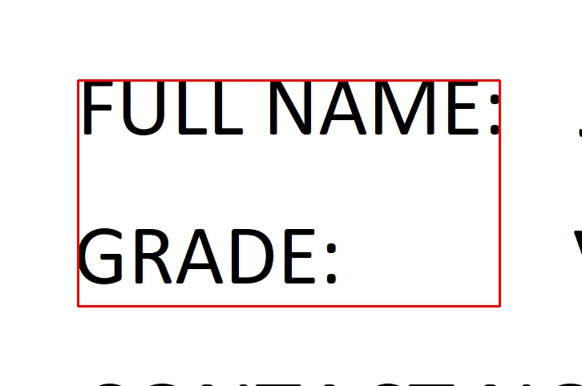<br>   |
| Multiline  | Yes | regex    | NA  | 1.0t | [<br>    {<br>  "anchorText": [<br>[<br> "^full name:$",<br> "john"<br>],<br>[<br> "^grade:$",<br> "VIII"<br>],<br>[<br> "^contact",<br> "no.:"<br>]<br>  ],<br>  "anchorTextMatch": {<br>"method": "regex",<br>"maxWordSpace": "1.0t"<br>  }<br>    }<br>] | <br>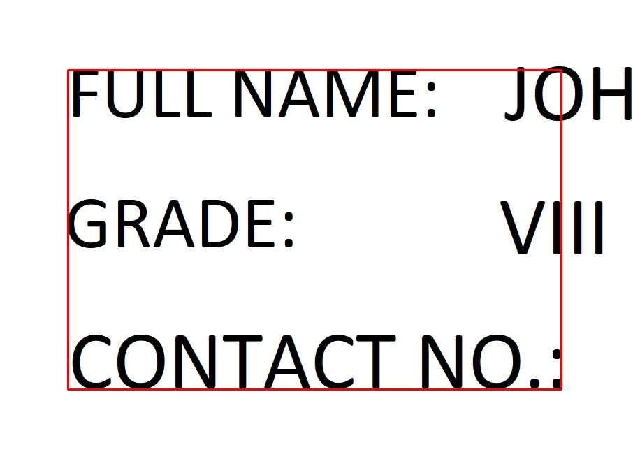<br><br> |
| Singleline | No  | normal   | 1   | 1.5t | [<br>    {<br>  "anchorText": [<br>[<br> "full name:"<br>]<br>  ],<br>  "anchorPoint1": {<br>"left": null,<br>"top": "-0.5t",<br>"right": "0",<br>"bottom": null<br>  },<br>  "anchorPoint2": {<br>"left": null,<br>"top": null,<br>"right": "2t",<br>"bottom": "0.5t"<br>  }<br>    }<br>]  | <br>  |
| Singleline | No  | normal, regex  | NA, 0.8| 1.0t, 1.5t | [<br>    {<br>  "anchorText": [<br>[<br> "^full name:$"<br>]<br>  ],<br>  "anchorTextMatch": {<br>"method": "regex",<br>"maxWordSpace": "1.0t"<br>  },<br>  "anchorPoint1": {<br>"left": "-0.1t",<br>"top": null,<br>"right": null,<br>"bottom": "0.2t"<br>  }<br>    },<br>    {<br>  "anchorText": [<br>[<br> "contact no"<br>]<br>  ],<br>  "anchorTextMatch": {<br>"method": "normal",<br>"similarityScore": 0.8<br>  },<br>  "anchorPoint1": {<br>"left": null,<br>"top": "-0.2t",<br>"right": 0,<br>"bottom": null<br>  }<br>    }<br>] | 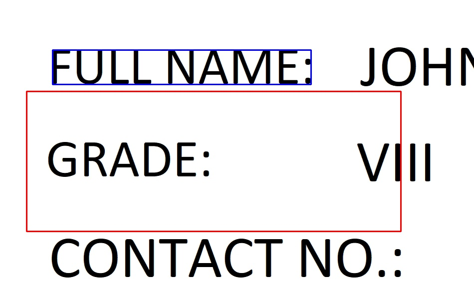<br>  |
| NA   | NA  | NA | NA  | NA| [<br>    {<br>  "anchorText": [<br>"{{EOD}}"<br>  ]<br>    },<br>    {<br>  "anchorText": [<br>"{{BOD}}"<br>  ]<br>    }<br>] | 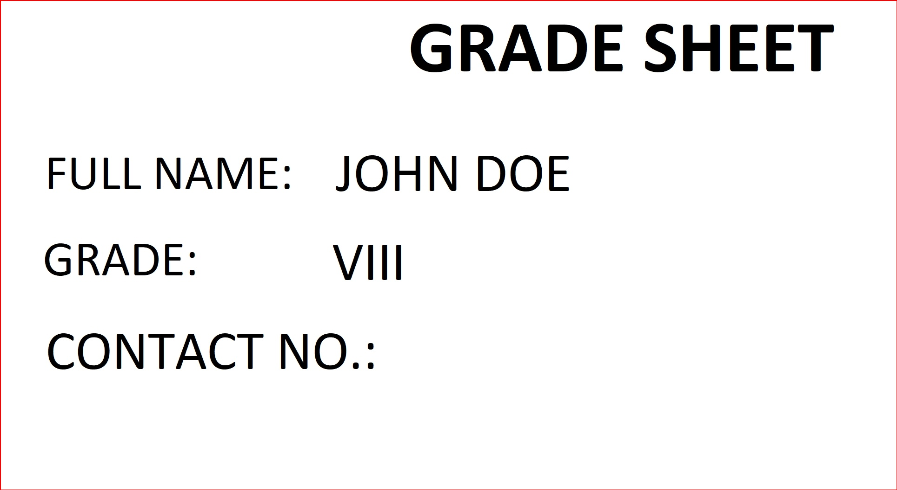<br>  |


#### AnchorPoint
 To create a bbox we need two diagonal points which can be obtained from the anchor text bbox. To do that we need to select any one of the four points from anchortext bbox which could be used as a reference to navigate through the image. Below are the diff combinations by which we can select a particular point and navigate to another point.

Point|Image|Format|New Point
-------|--------|-------|---------
Left, top| 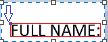|“left”: -10 <br>“right”: None<br>“top”: -15 <br>“bottom”: None|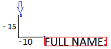 |
Right, top| 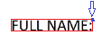| “left”: None<br>“right”: 10<br>“top”: -15 <br>“bottom”: None| 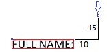|
Bottom, left|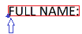 |“left”: -10<br>“right”: None<br>“top”: None<br>“bottom”: 15|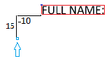 |
Bottom, right|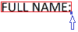|“left”: None<br>“right”: 10<br>“top”: None<br>“bottom”: 15| 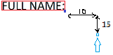|


**Tips and Suggestions:**

1. For better and flexible region definition creation, use relative value instead of hard numbers. Eg, use 't' or '%' instead of pixel values for defining anchor points
2. A region definition is a list where maximum of 2 elements can be passed. If a list of 1 element is passed then use 2 anchor points(`anchorPoint1` and `anchorPoint2`) to define a region and if 2 element is passed use 1 anchor point(`anchorPoint1`) for each element in the list.
    Ex.   
    ```python
        # With single element and two anchor points from the same anchor text
        reg_def_1 = [{
            'anchorText':'^name',
                'anchorPoint1': ['left':0,'top':0,'right':None,'bottom':None]
                'anchorPoint2': ['left':0,'top':0,'right':None,'bottom':None]
                'anchorTextMatch': {'method':'regex'} }]
        
        # With two elements and two anchor points from two different anchor texts and different match methods
        reg_def_2 = [
            {'anchorText':'^name',
                'anchorPoint1': ['left':0,'top':0,'right':None,'bottom':None]
                'anchorTextMatch': {'method':'regex'}},
            {'anchorText':'Name',
                'anchorPoint1': ['left':0,'top':0,'right':None,'bottom':None]
                'anchorTextMatch': {'method':'normal', 'similarityScore': 0.8} } ]
     ```
